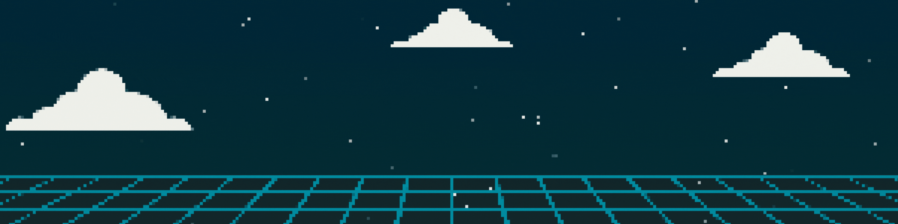
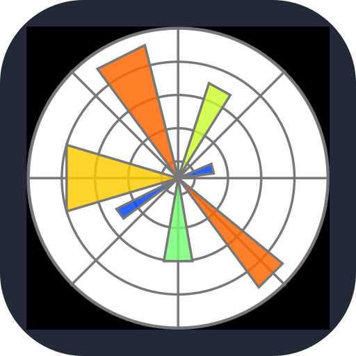
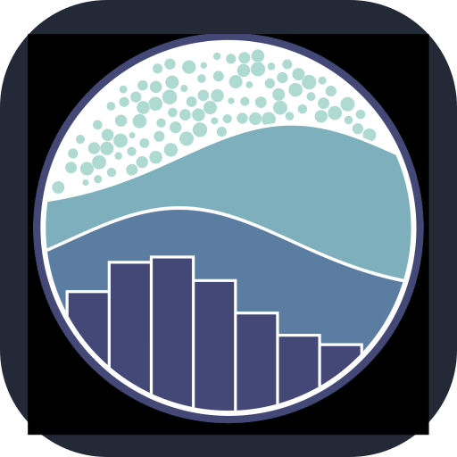
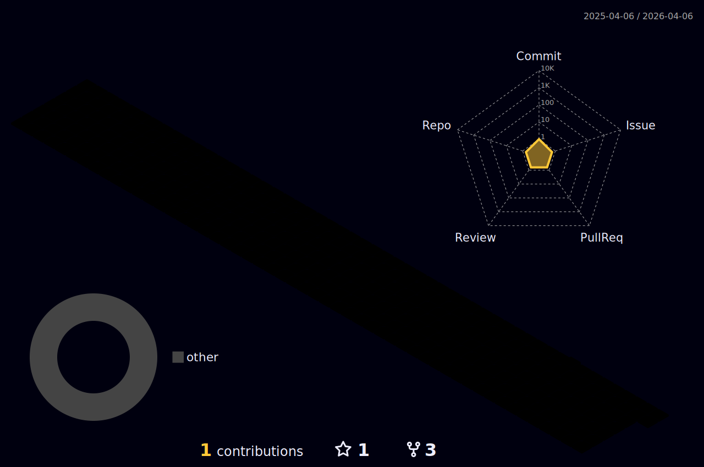

  

  

  

    

    

    

    

      I'm a Computer Science student, Python developer, inventor, and author dedicated to innovation and problem-solving. I love making computers do cool things, whether it's coding, building, or bringing ideas to life. Curiosity drives me, and I'm happiest when I'm creating something new—exploring, experimenting, and solving real problems.
    

  

  

    

    

    <h3 style="color: #00BC91; margin: 0 0 15px 0; font-size: 1.3em; position: relative; z-index: 1;">🎯 Current Mission</h3>
    

      Building things that make people say "Wait, how does that work?"
    

  

  

    

    

    <h3 style="color: #00BC91; margin: 0 0 15px 0; font-size: 1.3em; position: relative; z-index: 1;">🌟 Always</h3>
    

      Exploring • Experimenting • Breaking things (then fixing them)
    

  

##  &nbsp;My Technical Skills

  <!-- Row 7 -->
  

    
  

  <!-- Row 6 -->
  

    
    
  

  <!-- Row 5 -->
  

    
    
    
  

  <!-- Row 4 -->
  

    
    
    
    
  

  <!-- Row 3 -->
  

    
    
    
    
    
  

  <!-- Row 2 -->
  

    
    
    
    
    
    
  

  <!-- Row 1 -->
  

    
    
    
    
    
    
    
  

##  GitHub Analytics

   

  

   

      

 

  

## :zap: My LeetCode Stats 📊

  

## 🐍 Watch how the snake's eating my contributions

   

