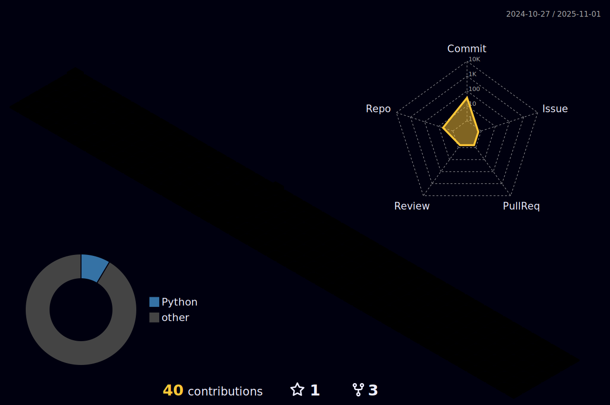

  

  

    Hello
    <h1>
           
    </h1>

##  &nbsp; My Technical Skills

  <!-- Row 7 -->
  

    
  

  <!-- Row 6 -->
  

    
    
  

  <!-- Row 5 -->
  

    
    
    
  

  <!-- Row 4 -->
  

    
    
    
    
  

  <!-- Row 3 -->
  

    
    
    
    
    
  

  <!-- Row 2 -->
  

    
    
    
    
    
    
  

  <!-- Row 1 -->
  

    
    
    
    
    
    
    
  

  

##  **GitHub Analytics**

   

  

   

      

 

   

## :zap: My LeetCode Stats 📊

  

   

